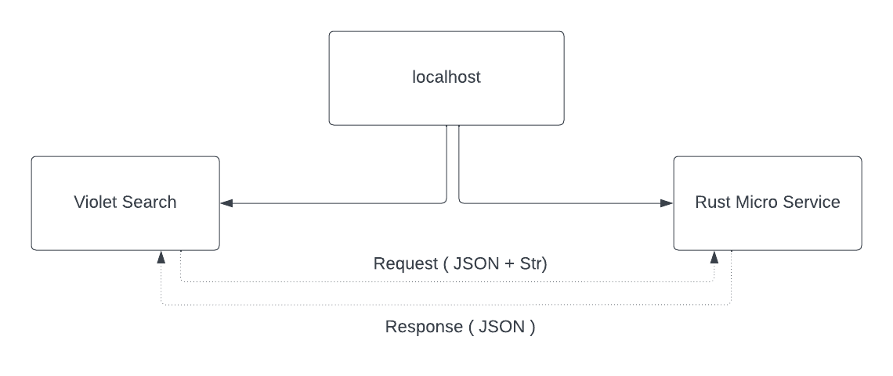
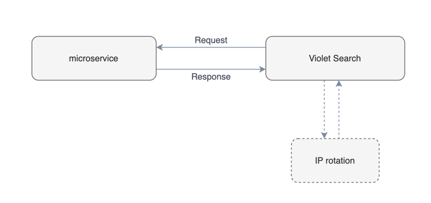

<div align="center">
<p></p>

# Violet Search Engine

<p align="center">
  <em>Privacy respecting, customizable search engine</em><br>
  <b>Your Gateway to Secure Discovery</b><br><br>
  Violet is a search engine that respects your privacy and allows you to customize your search experience. Violet is not a replacement for Google, but rather a tool to help you find what you are looking for without being tracked.
</p>
</div>

> Warning: Violet is still in development and should not be used in production. We are working hard to make Violet the best search engine out there, so if you have any feedback or suggestions, please let us know! can you create a issue on GitHub.

## Why Violet?

Because we believe that privacy is a fundamental human right that should be protected at all costs. We also believe that the internet should be a place where you can freely express yourself without being tracked or censored. Violet is our way of helping you achieve that.

## Features

- **Privacy Respecting**: Violet does not track you or your searches. We do not store your IP address, your search history, or any other information that could be used to identify you.
- **Strong Language Support**: Violet supports multiple languages, including English, French, German, Spanish, Italian, Portuguese, Greek, Chinese, Japanese, Korean, Turkish, and Azerbaijani.
- **Fast and Responsive**: Violet is fast and responsive. It is built using Rust and PHP, which are both fast and efficient programming languages. This means that Violet can handle a large number of requests without slowing down or crashing.
- **Meta Search or Own Results**: Violet allows you to choose between meta search results or your own results. Meta search results are provided by Google, Brave, DuckDuckGo, and other search engines. Your own results are provided by Violet's own crawler
- **Tor Results**: Violet allows you to search the Tor network. This means that you can search for websites that are only accessible through Tor.
- **Customizable**: Violet allows you to customize your search experience. You can choose from a variety of search engines, including Google, Bing, DuckDuckGo results. You can also choose to block certain websites from appearing in your search results.
- **Strong and Reliable Infrastructure**: Violet is developed using robust programming languages like Rust and PHP. Rust, in particular, offers advantages in terms of memory safety and performance, which can lead to a more stable and faster experience.
- **No Ads**: Violet does not show any ads. We do not track you, so we cannot show you ads. We do not make any money from Violet. We do not sell your data to third parties. We do not have any investors. We do not have any sponsors. We do not have any ads. Violet is completely free to use.
- **Clean Code**: Violet is written in PHP and uses the Laravel framework. The code is clean and easy to read. We have also included a lot of comments to help you understand what is going on...

## Process

Violet is having two main components: the search engine and the microservice. The search engine is written in PHP and uses the Laravel framework. The microservice is written in Rust. Here is a diagram of how the two components interact with each other (simple version): <br><br>
<br><br>
The microservice is responsible for crawling the web and indexing the pages. The search engine is responsible for serving the search results to the user.

## IP Rotation

Violet uses a proxy server to rotate the IP address of the microservice. This means that the microservice will have a different IP address each time it crawls a website. This helps prevent websites from blocking the microservice

<br><br>
> Note: This feature is in development and not default enabled. You can enable it in the `.env` file.

## Tor Connection

Violet allows you to search the Tor network. This means that you can search for websites that are only accessible through Tor. Violet uses the Tor frameworks to connect to the Tor network. This allows Violet to search the Tor network without having to install the Tor Browser Bundle.

If you clicked any Tor URL in the search results, Violet will open modal and open the URL in modal window.

> *Warning 1* : This feature can be dangerous. If you click on a malicious Tor URL, you could be exposed to malware or other harmful content. Please use this feature at your own risk.

> *Warning 2* : This feature can be slow. Because Violet has to connect to the Tor network, it can take a while for the search results to load. Please be patient.

## FAQ (Frequently Asked Questions)

### What is Violet?

Violet is a search engine that respects your privacy and allows you to customize your search experience. Violet is responsive, fast, and easy to use. It is also open source and free to use.
### How does Violet work?

Violet is a search engine. It works by crawling the web and indexing the pages. When you search for something, Violet will return the most relevant results based on your query. Violet also allows you to customize your search experience by choosing from a variety of search engines, including Bing, DuckDuckGo, Google, Own Results and more.

### Should I use Violet Search?

If you are looking for a search engine that respects your privacy and allows you to customize your search experience, then yes, you should use Violet Search.

### Is Violet Search free? How does Violet Search make money?

Violet Search is completely free to use. We do not make any money from Violet Search. We do not track you, so we cannot show you ads. We do not have any investors. We do not have any sponsors. We do not have any ads. Violet Search is completely free to use.

So how does Violet Search make money? basically, we don't. We are a non-profit organization that is funded by donations. If you would like to support us, please consider donating to our cause.

### Violet Search better than Google?

No, Violet Search is not better than Google. Because Violet Search is a meta search engine (for now), it does not have its own index. Instead, it uses the indexes of other search engines, such as Google, Bing, DuckDuckGo, and more. This means that Violet Search will return the same results as these search engines.

## Supported Languages and Search Engines

### Languages

- English
- French
- Germans
- Spanish
- Italian
- Portuguese
- Greek
- Chinese
- Japanese
- Korean
- Turkish
- Azerbaijani

If you would like to add support for another language, please open an issue on GitHub.
<br><br>
Or you can add it yourself by editing the `resources/lang` directory.
<br>
You can find more information about how to do this in the [Violet Language Documantation](LANGUAGE.md).
### Search Engines

- Google
- DuckDuckGo
- DuckDuckGo (Tor)
- Torch (Tor)
- Artado
- Qwant
- Yahoo
- Swisscows
- Startpage (Only results)
- Ecosia
- Ask
- Brave
- Violet Results (In Development)

## Setup and Setting Up Microservice

### Requirements

- PHP 7.4 or higher
- MySQL 5.7 or higher
- Composer
- Rust

### Installation search engine

1. Clone the repository

```bash
git clone https://github.com/violet-eco/violet-search
```

2. Install dependencies

```bash
composer install
```

3. Enter violet-search dir

```bash
cd violet-search
```
4. Copy the `.env.example` file to `.env` and update the database credentials

```bash
cp .env.example .env
```

5. Generate a new application key

```bash
php artisan key:generate
```

6. Start the development server

```bash
php artisan serve
```

### Setting Up Microservice

2. Enter the microservice directory

```bash
cd microservice
```

3. Build the microservice

```bash
cargo build --release
```

4. Run the microservice

```bash
cargo run --release
```

## Contributing

Contributions are always welcome! If you have any suggestions or would like to contribute to the project, please open an issue on GitHub. You can also fork the repository and submit a pull request.

Please read the [CONTRIBUTING.md](CONTRIBUTE.md) file for more information.

## License

Violet is licensed under the GPL-3.0 License. See [LICENSE](LICENSE) for more information.
